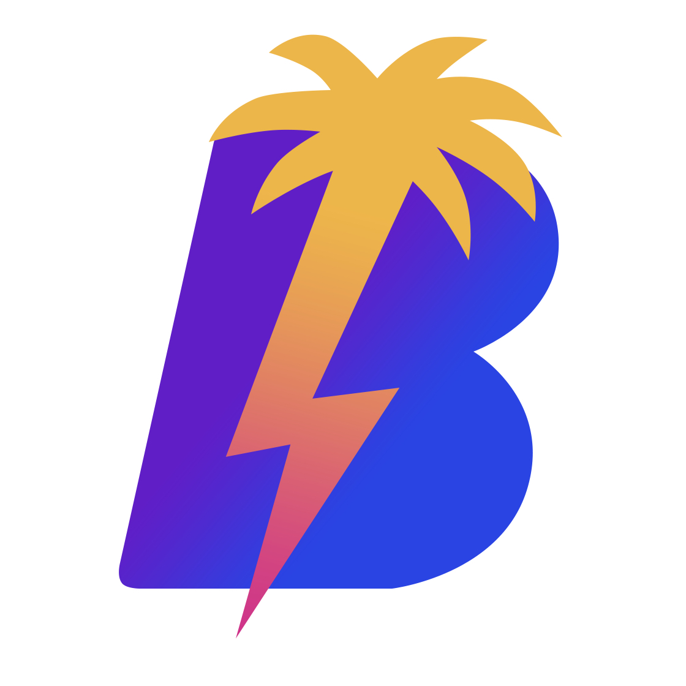

# Bay Wallet

ldk wallet & nostr client for the plebs of tampa, by tampa plebs.



## Description

Bay Wallet is a project spawned from the Tampa BitDevs meetup. The goal of the project is to inspire new Bitcoin developers to work on a Bitcoin project in a collaborative environment with experienced Bitcoin developers.

Bay Wallet is built with LDK, a Lightning implementation library. LDK allows developers to create full node implementations wihtout having to use a monolithic node implementation such as LND, Core Lightning, or Eclair. This bodes well for mobile because we can run a full node on the device.

Included with Bay Wallet is a nostr client. Having a nostr client included with a Lightning wallet creates a seamless UX for zaps, community engagement, as well as app support.

***Resources***
* [nostr-tools](https://github.com/nbd-wtf/nostr-tools)
* [nostr-hooks](https://github.com/sepehr-safari/nostr-hooks)
* [LDK (rust-lightning)](https://github.com/lightningdevkit/rust-lightning)
* [LDK Project Website](https://lightningdevkit.org/)
* [React-Native LDK by Synonym](https://github.com/synonymdev/react-native-ldk)

## Pre-requisites

For andorid development (on ubuntu & mac) you need to follow this guide to [install Android Studio and setup an emulator](https://androidwave.com/install-and-setup-react-native-on-ubuntu/).

For Windows follow [this guide](https://reactnative.dev/docs/environment-setup)

The recommended node version is 18, if not installed we recommend using [nvm](https://github.com/nvm-sh/nvm).

## Troubleshooting

If you are having issues with the build, try the following:
```
yarn clean

# If you are using Windows or Ubuntu
yarn clean:android

```

## Install Instructions

Download the code base and install dependencies.
```
git clone https://github.com/bennyhodl/baywallet.git

cd baywallet

yarn install

# For iOS development

```

### iOS
```
# Upgrade hombrew
brew upgrade

# Pods (Ruby - optional)
sudo gem install cocoapods

# Install Pods (with Ruby)
cd ios && pod install && cd ..

# or if not using Ruby
npx pod-install
```

Start Bay Wallet!
```
# Setup react-native for your operating system.
yarn rn-setup

# iOS
yarn ios

# Android
yarn android
```
## Features
> List of features that could be supported for Bay Wallet. This list serves as an entrypoint for developers to pick a feature they want to implement. New developers can implement from the list or check out the [issues](https://github.com/bennyhodl/baywallet/issues).

### Nostr

Bay Wallet has the goal of being a full nostr client as well as supporting Tampa's meetup, Bitcoin Bay. With chats, marketplaces, and business discovery.

- [x] [NIP-01: Basic protocol flow description](https://github.com/nostr-protocol/nips/blob/master/01.md)<br>
- [x] [NIP-02: Contact List and Petnames](https://github.com/nostr-protocol/nips/blob/master/02.md)<br>
- [ ] [NIP-03: OpenTimestamps Attestations for Events](https://github.com/nostr-protocol/nips/blob/master/03.md)<br>
- [ ] [NIP-04: Encrypted Direct Message](https://github.com/nostr-protocol/nips/blob/master/04.md)<br>
- [x] [NIP-05: Mapping Nostr keys to DNS-based internet identifiers](https://github.com/nostr-protocol/nips/blob/master/05.md)<br>
- [ ] [NIP-06: Basic key derivation from mnemonic seed phrase](https://github.com/nostr-protocol/nips/blob/master/06.md)<br>
- [ ] [NIP-08: Handling Mentions](https://github.com/nostr-protocol/nips/blob/master/08.md)<br>
- [ ] [NIP-09: Event Deletion](https://github.com/nostr-protocol/nips/blob/master/09.md)<br>
- [ ] [NIP-10: Conventions for clients' use of `e` and `p` tags in text events](https://github.com/nostr-protocol/nips/blob/master/10.md)<br>
- [ ] [NIP-15: Nostr Marketplace](https://github.com/nostr-protocol/nips/blob/master/15.md)
- [ ] [NIP-19: bech32-encoded entities](https://github.com/nostr-protocol/nips/blob/master/19.md)<br>
- [ ] [NIP-20: Command Results](https://github.com/nostr-protocol/nips/blob/master/20.md)<br>
- [ ] [NIP-21: `nostr:` URL scheme](https://github.com/nostr-protocol/nips/blob/master/21.md)<br>
- [ ] [NIP-23: Long-form Content](https://github.com/nostr-protocol/nips/blob/master/23.md)<br>
- [ ] [NIP-25: Reactions](https://github.com/nostr-protocol/nips/blob/master/25.md)<br>
- [ ] [NIP-26: Delegated Event Signing](https://github.com/nostr-protocol/nips/blob/master/26.md)<br>
- [ ] [NIP-28: Public Chat](https://github.com/nostr-protocol/nips/blob/master/28.md)<br>
- [ ] [NIP-33: Parameterized Replaceable Events](https://github.com/nostr-protocol/nips/blob/master/33.md)<br>
- [ ] [NIP-39: External Identities in Profiles](https://github.com/nostr-protocol/nips/blob/master/39.md)<br>
- [ ] [NIP-40: Expiration Timestamp](https://github.com/nostr-protocol/nips/blob/master/40.md)<br>
- [ ] [NIP-42: Authentication of clients to relays](https://github.com/nostr-protocol/nips/blob/master/42.md)<br>
- [ ] [NIP-46: Nostr Connect](https://github.com/nostr-protocol/nips/blob/master/46.md)<br>
- [ ] [NIP-50: Keywords filter](https://github.com/nostr-protocol/nips/blob/master/50.md)<br>
- [ ] [NIP-51: Lists](https://github.com/nostr-protocol/nips/blob/master/51.md)<br>
- [ ] [NIP-56: Reporting](https://github.com/nostr-protocol/nips/blob/master/56.md)<br>
- [ ] [NIP-57: Lightning Zaps](https://github.com/nostr-protocol/nips/blob/master/57.md)<br>
- [ ] [NIP-58: Badges](https://github.com/nostr-protocol/nips/blob/master/58.md)<br>
- [ ] [NIP-65: Relay List Metadata](https://github.com/nostr-protocol/nips/blob/master/65.md)<br>

### Lightning

- [x] Bitcoin only wallet
- [x] Non-custodial
- [x] No processing fees
- [x] No KYC
- [x] Fully open source (MIT)
- [x] Node runs on the device
- [ ] On-chain accounts
- [ ] NFC payments and requests
- [ ] PIN or passphrase encryption
- [ ] Privacy mode - hide your sensitive data
- [ ] Lightning address send
- [ ] Lightning address receive
- [ ] Full LNURL support (pay, withdraw, auth, channel)
- [x] Lightning channel management
- [ ] MPP/AMP support
- [ ] Keysend support
- [ ] Fiat currency integrations
- [ ] On-chain coin control
- [ ] Contact list for easier payments
- [ ] Multiple profile types (payments, merchant etc.)
- [ ] Notifications 
- [ ] Flow v2 LSP
- [ ] Zero conf channels

## LDK chain backend
Bay Wallet uses `esplora` and `mempool.space` for the chain backend. To change the Bitcoin environment you can edit the `mempoolBackend` in `src/util/config.ts`
```
# Regtest
mempool.bitcoinbay.engineering

# Signet
mutinynet.com

# Mainnet
mempool.space
```
